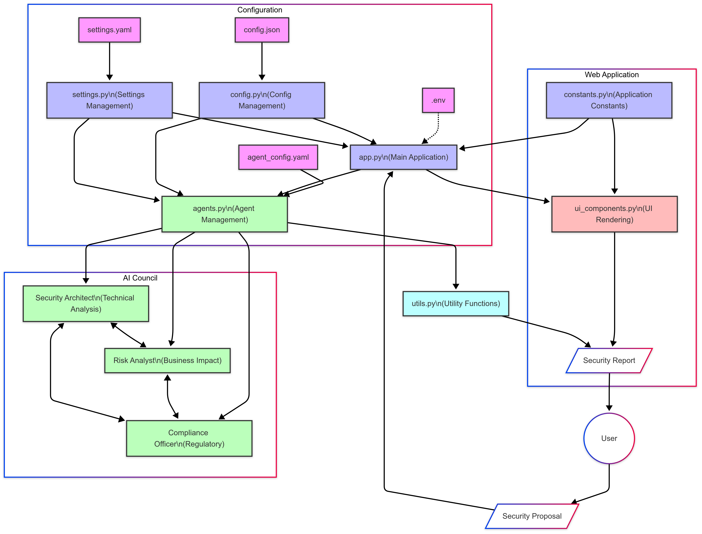

# Let's Build Enterprise Cybersecurity Risk Assessment Using AI Agents 

Sales Workflow with AI-Powered Agents

## TL;DR
Built a comprehensive sales pipeline management system using AI agents to qualify leads, develop strategies, and create closing plans. The system uses Streamlit for the interface, CrewAI for agent orchestration, and maintains a historical database of all analyses.

## Introduction:
I developed this AI-powered sales pipeline management system to show how businesses handle their sales processes. The system combines multiple specialized AI agents to analyze leads, develop strategies, and create closing plans — all while maintaining a structured, data-driven approach.

## What’s This Article About?
This article explores the implementation of an AI-based sales pipeline management system. It demonstrates how multiple AI agents can work together to analyze sales leads, each specializing in different aspects of the sales process — from initial qualification to closing strategies. The system provides structured, consistent analysis while maintaining a historical record of all leads and decisions.

Full Article : [https://medium.com/@learn-simplified/Lets-Build-Enterprise-Cybersecurity-Risk-Assessment-Using-AI-Agents-d7a3df09686b


## Tech Stack

| **Category**   | **Technology**                | **Purpose**                          |
|----------------|-------------------------------|--------------------------------------|
| Framework      | Streamlit                     | Web interface and UI components      |
| AI             | AutoGen                       | Multi-agent conversation framework   |
| AI             | OpenAI GPT-4                  | Large language model for agents      |
| Configuration  | YAML                          | Agent and application configuration  |
| Configuration  | JSON                          | LLM settings and feature flags       |
| Environment    | python-dotenv                | Environment variable management      |
| Utilities      | asyncio                       | Asynchronous processing              |
| Reporting      | Markdown                      | Report generation format              |
| Logging        | Python logging                | Application logging                  |


## Why Read It?
AI is transforming business operations, particularly in sales. This implementation shows how companies can leverage AI to standardize their sales processes, make data-driven decisions, and scale their operations effectively. The system demonstrates practical application of AI in sales, from lead qualification to closing strategies.

## Architecture




# Tutorial: Let's Build Enterprise Cybersecurity Risk Assessment Using AI Agents

## Prerequisites
- Python installed on your system.
- A basic understanding of virtual environments and command-line tools.

## Steps

1. **Virtual Environment Setup:**
   - Create a dedicated virtual environment for our project:
   
     ```bash
     python -m venv Lets-Build-Enterprise-Cybersecurity-Risk-Assessment-Using-AI-Agents
     ```
   - Activate the environment:
   
     - Windows:
       ```bash
          Lets-Build-Enterprise-Cybersecurity-Risk-Assessment-Using-AI-Agents\Scripts\activate        
       ```
     - Unix/macOS:
       ```bash
       source Lets-Build-Enterprise-Cybersecurity-Risk-Assessment-Using-AI-Agents/bin/activate
       ```
   

# Installation and Setup Guide

**Install Project Dependencies:**

Follow these steps to set up and run the  "Let's Build Enterprise Cybersecurity Risk Assessment Using AI Agents"

1. Navigate to your project directory:
   ```
   cd path/to/your/project
   ```
   This ensures you're in the correct location for the subsequent steps.

2. Install the required dependencies:
   ```
   pip install -r requirements.txt   
   ```
   This command installs all the necessary Python packages listed in the requirements.txt file.


Run - Hands-On Guide: Let's Build Enterprise Cybersecurity Risk Assessment Using AI Agents

  
   ```
   streamlit run app.py
   ```
   


